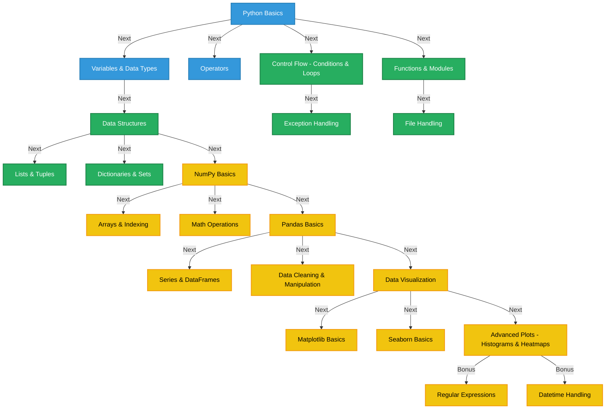

# Upskill Series: Data Analysis with Python

## Table of Contents
1. [Overview](#overview)
2. [Learning Objectives](#learning-objectives)
3. [Prerequisites](#prerequisites)
4. [Setup Instructions](#setup-instructions)
   - [Install Python](#1-install-python)
   - [Install Jupyter Notebook](#2-install-jupyter-notebook-recommended)
   - [Install Required Libraries](#3-install-required-libraries)
   - [Verify Installation](#4-verify-installation)
5. [Roadmap](#roadmap)
6. [How to Participate](#how-to-participate)

## Overview
The **Ajira Digital Club of Kirinyaga University** presents the **Upskill Series**, an initiative designed to equip members and the wider community with industry-relevant skills. 

The first session in this series focuses on **Data Analysis with Python**, building on previous training in Excel-based data analysis. This hands-on training will guide participants through Python programming fundamentals, data manipulation, and visualization using key libraries like **NumPy, Pandas, Matplotlib, and Seaborn**.

## Learning Objectives
By the end of this training, participants will:
- Understand Python programming basics
- Work with data structures and control flow in Python
- Handle data files and perform basic data cleaning
- Use **NumPy** for numerical computations
- Use **Pandas** for data manipulation
- Create visualizations using **Matplotlib** and **Seaborn**

## Prerequisites
To get the most out of this training, you should:
- Have basic computer literacy
- Be familiar with spreadsheets (Excel/Google Sheets is a plus but not required)
- Have an eagerness to learn Python!

## Setup Instructions
Follow these steps to set up your environment:

### 1. Install Python
Download and install the latest version of Python from [python.org](https://www.python.org/downloads/).

### 2. Install Jupyter Notebook (Recommended)
Jupyter Notebook provides an interactive coding environment:
```bash
pip install jupyterlab
```
Run Jupyter Notebook with:
```bash
jupyter lab
```

### 3. Install Required Libraries
Ensure you have the necessary Python libraries installed:
```bash
pip install numpy pandas matplotlib seaborn
```

### 4. Verify Installation
Run the following command in Python to check installations:
```python
import numpy as np
import pandas as pd
import matplotlib.pyplot as plt
import seaborn as sns
print("Setup Successful!")
```

## Roadmap
Below is the structured roadmap for the training:



## How to Participate
- Join our live sessions.
- Follow along with provided notebooks and exercises
- Engage with the community, ask questions, and collaborate!

---
**Let’s upskill together! 🚀**

